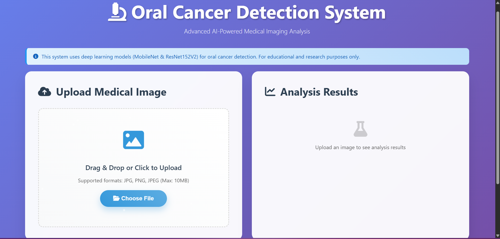

# Oral Cancer Detection Using Deep Learning
Hi there 👋, this is a mini-project I built as part of my B.Tech course. The idea behind this project is to help detect oral cancer early using deep learning models.

This web application allows users (like healthcare professionals or students) to upload images of the oral cavity, and the system will predict whether it’s Cancer or Non-Cancer using two popular models — ResNet152V2 and MobileNet.

## Features

- Image upload option for predictions.

- Deep learning models trained using transfer learning.

- Real-time predictions with confidence scores.

- Simple and clean Flask-based web interface.

- Integrated ResNet152V2 for high accuracy and MobileNet for faster predictions.

## Tech Stack

- Python

- TensorFlow

- Flask

- Pillow (for image processing)

- Tailwind CSS (for frontend design)

- ResNet152V2, MobileNet (CNN models)

- Anaconda prompt

## o/p
